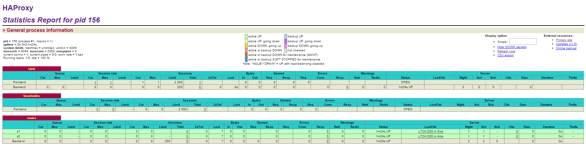
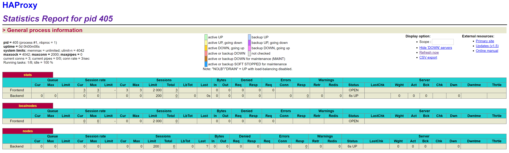
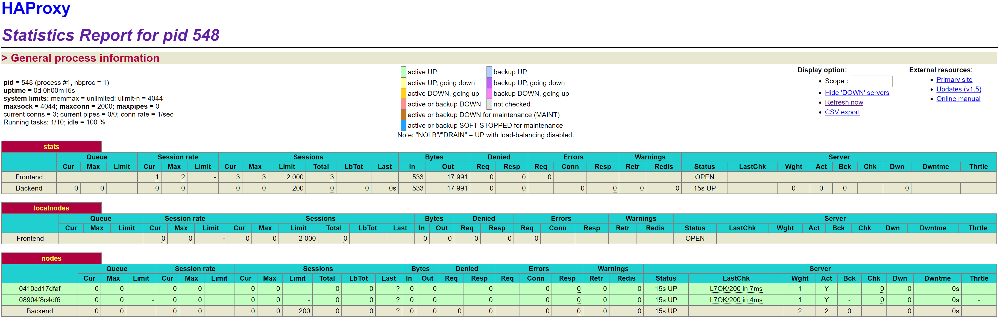
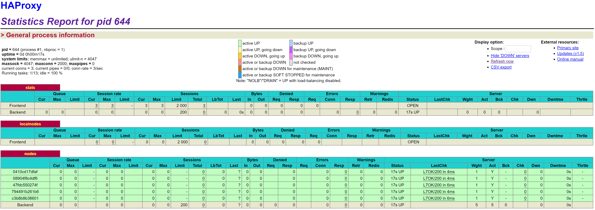
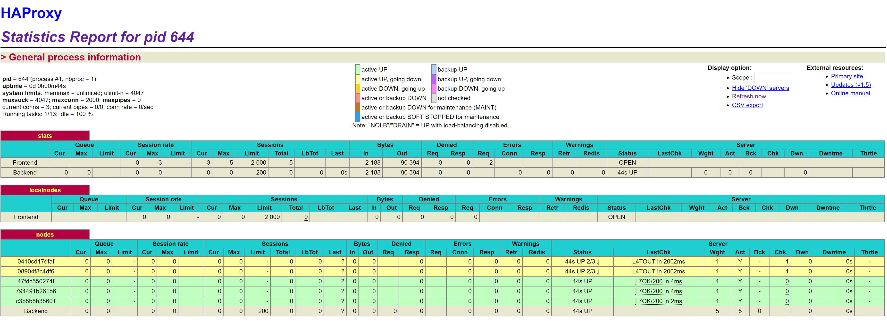

Samuel Darcey - Bastien Rouiller

# Lab 04 – Docker
##Table of contents
1. Introduction
2. Task 0: Identify issues and install the tools
3. Task 1: Add a process supervisor to run several processes
4. Task 2: Add a tool to manage membership in the web server cluster
5. Task 3: React to membership changes
6. Task 4: Use a template engine to easily generate configuration files
7.  Task 5: Generate a new load balancer configuration when membership changes
8.  Task 6: Make the load balancer automatically reload the new configuration
9. Conclusion

##Introduction
This lab is based on the previous lab on load balancing. In this lab we are deploying a supervisor on the containers and we are managing a web server cluster with Serf. The load balancer must be able to adapt to any changes in architecture (web app server being added or removed) by automatically reloading its configuration.

##Task 0: Identify issues and install the tools
###M1
We do not think we can use the current solution for a production environment. The main problem is when we want to add or remove server; we need to manually reconfigure the load balancer every time.
###M2
We need to add thoses lines
In the script file ha/scripts/run.sh
> sed -i 's/<s3>/$S3_PORT_3000_TCP_ADDR/g' /usr/local/etc/haproxy/haproxy.cfg

In the haproxy configuration file (Haproxy.cfg), we add the server in the list of nodes :
> server s3 172.17.0.4:3000

Depending on the balance policy we might need to add more configuration.
###M3
We need a way to automatically discover new nodes. We could use multicast to achieve this.
###M4
When we use multicast we can send a packet to all nodes in the network. In this way we can discover when a new node appears or disappear.
###M5
Our current solution is not able to run additional management processes. Docker was  designed to run only one process for each container and will shut down if the process stops. The load balancer is already running haproxy and the webservers are running the nodejs service. We need to group the services into a super service so docker thinks it runs only one process.

###M6
No it's not dynamic. We can use a bash script on the load balancer that changes the configuration based on input parameters (ip and server name of the newly added node).


github repo :
> https://github.com/beedle-/Teaching-HEIGVD-AIT-2016-Labo-Docker


## Task 1: Add a process supervisor to run several processes

####  1. Take a screenshot of the stats page of HAProxy at http://192.168.42.42:1936. You should see your backend nodes. It should be really similar to the screenshot of the previous task.
We can effectively see the backend nodes:



#### 2. Describe your difficulties for this task and your understanding of what is happening during this task. Explain in your own words why are we installing a process supervisor. Do not hesitate to do more research and to find more articles on that topic to illustrate the problem.
The main difficulty we had for this task was to understand what is s6 and why is process supervision useful for our architecture.
We are installing a process supervisor (S6) so the container is not dependant on the main process (haproxy or nodejs). We are launching the container with S6 and not haproxy or nodejs. We can imagine to make it run multiple processes in the future. 
S6 allows us to have better control and manage the processes inside the containers.

We could imagine installing both Apache and OpenSSH on the same container using S6.


## Task 2: Add a tool to manage membership in the web server cluster

#### 1. Provide the docker log output for each of the containers: ha, s1 and s2. You need to create a folder logs in your repository to store the files separately from the lab report. For each lab task create a folder and name it using the task number. No need to create a folder when there are no logs.
Docker log output for each containers :
[ha](../logs/task2/ha.txt)
[s1](../logs/task2/s1.txt)
[s2](../logs/task2/s2.txt)

#### 2. Give the answer to the question about the existing problem with the current solution.
The problem is that the new container need to register to the cluster through ha container. Ideally registration should be decentralized and new node should be able to register through any node.

#### 3. Give an explanation on how Serf is working. Read the official website to get more details about the GOSSIP protocol used in Serf. Try to find other solutions that can be used to solve similar situations where we need some auto-discovery mechanism.
Serf manages cluster memberships. It allows to detect new members or departing members. It uses GOSSIP protocol, which is based on SWIM protocol. This protocols consists of sending broadcast to the cluster to detects members. It starts with one nodes and "contaminates" other nodes until convergence.
ZooKeeper is an alternative to Serf. It is much more complex.

## Task 3: React to membership changes
#### 1. Provide the docker log output for each of the containers: ha, s1 and s2. Put your logs in the logs directory you created in the previous task.
Docker logs for each noes :

- [ha](../logs/task3/Docker_Logs_ha.txt)
- [s1](../logs/task3/Docker_Logs_s1.txt)
- [s2](../logs/task3/Docker_Logs_s2.txt)

#### 2. Provide the logs from the ha container gathered directly from the /var/log/serf.log file present in the container. Put the logs in the logs directory in your repo.
[log serf](../logs/task3/serf_ha.txt)

## Task 4: Use a template engine to easily generate configuration files
#### 1. You probably noticed when we added xz-utils, we have to rebuild the whole image which took some time. What can we do to mitigate that? Take a look at the Docker documentation on image layers. Tell us about the pros and cons to merge as much as possible of the command. In other words, compare:
```
RUN command 1
RUN command 2
RUN command 3
```
vs.
```

RUN command 1 && command 2 && command 3
```
When using multiple lines we have multiple layers. With the second option we have only one layer. The advantage of the first option is that when you change one command, docker will only build the layer (the command) that the you changed. The second action is good when multiple action need to be executed one after the other and will always be executed together, for example : 
> RUN apt-get update && apt-get install.

####There are also some articles about techniques to reduce the image size. Try to find them. They are talking about squashing or flattening images.
Docker creates many layers when building an image. For example when there is instruction to add new file in the docker file, if it is temporary files later deleted, docker will keep this layer. Squashing reorganize the logical layer by reducing the number of layers. It allows to reduce the size of the docker image. When flattening images, we put multiple commands (layers) in one same command like shown on the previous question.

> source : https://github.com/goldmann/docker-squash

####2. Propose a different approach to architecture our images to be able to reuse as much as possible what we have done. Your proposition should also try to avoid as much as possible repetitions between your images.

We should maximize the factorization for commands that are use on multiple nodes.

####3. Provide the /tmp/haproxy.cfg file generated in the ha container after each step. Place the output into the logs folder like you already did for the Docker logs in the previous tasks. Three files are expected. 

- [Before s1 and s2 started](../logs/task4/before_s1_s2.txt)

- [After s1 started](../logs/task4/after_s1.txt)

- [After s1 and s2 started](../logs/task4/after_s1_s2.txt)


####In addition, provide a log file containing the output of the docker ps console and another file (per container) with docker inspect <container>. Four files are expected.


####4. Based on the three output files you have collected, what can you say about the way we generate it? What is the problem if any?


## Task 5: Generate a new load balancer configuration when membership changes

### Logs obtained after the tests

- [ha logs](logs/task5/logs_ha.txt)

- [s1 logs](../logs/task5/s1.txt)

- [s2 logs](../logs/task5/s2.txt)


#### 1. Provide the file /usr/local/etc/haproxy/haproxy.cfg generated in the ha container after each step. Three files are expected.

- [Before s1 and s2 started](../logs/task5/before_s1_s2.txt)

- [After s1 started](../logs/task5/after_s1.txt)

- [After s1 and s2 started](../logs/task5/after_s1_s2.txt)


#### In addition, provide a log file containing the output of the docker ps console and another file (per container) with docker inspect <container>. Four files are expected.
- [docker ps](../logs/task5/docker_ps.txt)

- [docker inspect ha](../logs/task5/docker_inspect_ha.txt)

- [docker inspect s1](../logs/task5/docker_inspect_s1.txt)

- [docker inspect s2](../logs/task5/docker_inspect_s2.txt)
#### 2. Provide the list of files from the /nodes folder inside the ha container. One file expected with the command output.
[List of nodes](../logs/task5/nodes.txt)

#### 3. Provide the configuration file after you stopped one container and the list of nodes present in the /nodes folder. One file expected with the command output. Two files are expected.
- [ha config](../logs/task5/ha_without_s1.txt)

- [list of nodes](../logs/task5/node_without_s1.txt)

#### In addition, provide a log file containing the output of the docker ps console. One file expected.

[docker ps](../logs/task5/ps_without_s1.txt)

##Task 6: Make the load balancer automatically reload the new configuration
####1. Take a screenshots of the HAProxy stat page showing more than 2 web applications running. Additional screenshots are welcome to see a sequence of experimentations like shutting down a node and starting more nodes.

#### Also provide the output of docker ps in a log file. At least one file is expected. You can provide one output per step of your experimentation according to your screenshots.

- We first started with no node :
 


[log](../logs/task6/noNode.txt)

- Then we turned on two nodes :



[log](../logs/task6/2Nodes.txt)

- Then 3 more nodes :



[log](../logs/task6/5Nodes.txt)

- We choosed to take down 2 nodes :
This screenshot shows the 2 nodes going down :



And then down :


[log](../logs/task6/2NodesDowned.txt)

####2. Give your own feelings about the final solution. Propose improvements or ways to do the things differently. If any, provide references to your readings for the improvements.


####3. (Optional:) Present a live demo where you add and remove a backend container.

## Conclusion
In this lab we were able to deploy an architecture allowing scalability and. We could imagine deploying this in production environment. 
